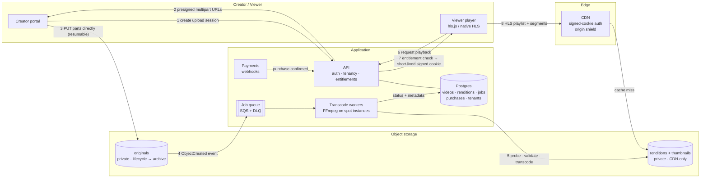

# Video platform architecture

How CreatorHub would handle **Creator upload → Processing → Storage → Delivery → Playback** in production. The portal in this repo already uses the same contracts locally: signed upload URLs, signed playback URLs, range requests and workspace-scoped keys. Moving to production swaps the storage backend; the client code stays the same.

> **What the live demo actually runs on:** uploads are stored in a private **Vercel Blob** store, not S3. Running S3 and CloudFront for a demo would mean AWS billing for no real traffic, so the deployment uses the Blob store that comes with the Vercel project. It follows the same contract described here: a presigned PUT straight from the browser, a confirm step that checks the stored size, and short-lived presigned GETs for playback. Local development uses disk. The S3 (or R2) and CloudFront design below remains the plan for production scale.

> The guiding principle: **spend money in proportion to demand.** A video with 5 views and a video with 500,000 views should not cost the same to process, store or deliver.

---

## Architecture diagram

---

## A. Upload

**Large files must not go through the application server.** Proxying a 4 GB upload holds a connection and memory on the app tier for minutes, multiplies bandwidth costs, hits serverless body and time limits, and couples upload throughput to API scaling. Instead the API **authorises** the upload and the bytes go **directly to object storage**.

1. **Create an upload session (`POST /uploads`).** The API checks auth, workspace membership, quota, declared MIME type and size. It records an `uploads` row (`pending`) and returns presigned **S3 multipart** part URLs.
2. **Upload parts from the client.** Files are split into 8–16 MB parts, with 3–4 uploading in parallel. Progress is the sum of acknowledged bytes per part, which gives a real percentage, speed and time remaining.
3. **Resume after interruptions.** Each completed part's ETag is saved locally (IndexedDB). After a dropped connection, a closed tab or a phone switching networks, the client calls `ListParts` and uploads only the missing parts. On slow connections, fewer parallel parts and smaller parts keep each request short enough to complete.
4. **Validate twice.** The client checks type and size before starting, for fast feedback. The server checks again after upload (see Processing), because the client can't be trusted.
5. **Complete the upload.** `CompleteMultipartUpload`, then an `ObjectCreated` event goes onto the queue. Abandoned multipart uploads expire through a bucket lifecycle rule after 7 days, so half-uploaded files don't accumulate storage cost.

**Mobile:** uploads continue while the creator fills in the form (the portal already does this). Wi-Fi-only uploads for large files is a small next step. Short-lived URLs are re-requested per part rather than issued once with a long expiry.

**In this repo:** `POST /api/workspaces/:slug/uploads` validates the file and returns a 15-minute HMAC-signed PUT URL. The browser `PUT`s straight to `/api/uploads/:key`, a local stand-in for the bucket that verifies the signature, enforces the declared size and rejects replays. Files land in `.data/uploads`. Progress comes from real `XMLHttpRequest` upload events.

## B. Processing

When the object lands, the work runs as an idempotent job keyed by `upload_id`:

1. **Validate.** `ffprobe` checks the real container and codec (not just the extension), duration, resolution and frame rate, and rejects corrupt or zero-length files. File signatures are checked. An optional malware scan applies to non-video files such as documents.
2. **Extract metadata.** Duration, dimensions, bitrate and audio tracks go into Postgres. A content hash (SHA-256 of the original) **deduplicates** re-uploads, so the same file is never transcoded twice.
3. **Generate thumbnails.** Candidate frames come from three points in the video, plus a sprite sheet with a WebVTT index for scrubbing previews.
4. **Transcode.** The output is **HLS with CMAF (fMP4) segments**: 4-second segments with keyframe-aligned GOPs, so every rendition switches cleanly and seeking lands on a segment boundary.

### Avoiding unnecessary processing cost

The bitrate ladder is decided by **lifecycle stage and demand**, not produced in full for every upload.

| Stage | What gets encoded | Why |
|---|---|---|
| Uploaded (draft) | A 360p preview and thumbnails only | Many drafts are never published. Creators only need a preview. |
| Published | 720p, 480p and 360p | Covers most devices and networks at a fraction of the full ladder's cost. |
| Popular (e.g. > 1,000 views in 7 days, or many high-bandwidth viewers) | Add 1080p, and eventually per-title encoding | Spend encode minutes where they are watched. |

Other cost rules:

- **Never upscale.** The ladder is capped at the source resolution, so a 720p upload never gets a 1080p rendition.
- **Skip near-duplicate renditions** when the source bitrate is already low.
- **Run FFmpeg on spot instances** (ECS or AWS Batch) behind a queue. Jobs are idempotent and checkpointed per rendition, so a reclaimed spot instance just retries. This costs roughly 5–10× less than a managed per-minute transcoding service at volume. A managed service (MediaConvert, Mux) is the right *starting point* while volume is low, because it costs no engineering time.
- **Retry with backoff, then a dead-letter queue.** A failed job marks the video `processing_failed` with a reason the creator can act on ("unsupported codec, export as H.264"), and nothing is retried forever.

## C. Storage

| Data | Where | Why |
|---|---|---|
| Original uploads | Object storage (S3 or R2), **private**. Lifecycle moves them to an archive tier (Glacier Instant Retrieval or Deep Archive) after 30 days. | Needed only for re-encoding (new codecs, adding 1080p). Archive tiers are about 20× cheaper. |
| Renditions (HLS playlists and segments) | Object storage, **private**, readable only by the CDN (origin access control) | Immutable files that are cached forever at the edge. Never publicly addressable. |
| Thumbnails and sprites | Object storage behind the CDN, cacheable | Small and very hot. |
| Metadata (videos, renditions, jobs, purchases, tenants) | **Postgres** (managed: RDS, Neon or Aurora) | Relational data with strong consistency. Purchases and entitlements must be transactional. |
| Hot counters (views) | Redis, flushed to Postgres in batches | Avoids a write on every play. |

Keys are namespaced by tenant (`{workspaceId}/{videoId}/…`), so tenant isolation also holds at the storage layer. This repo already does it (`ws_…/video/<uuid>.mp4`).

**Vendor choice:** Cloudflare R2 has **no egress fees**, which matters more than anything else at this scale (see costs). S3 plus CloudFront is the safer default if the rest of the stack is on AWS. The design works with either. The current demo uses Vercel Blob purely to avoid AWS costs; swapping it for S3 or R2 only changes the server's storage driver.

## D. Streaming and content delivery

- **Adaptive bitrate (HLS).** Each player picks the rendition its bandwidth can sustain and switches mid-stream. This handles the "different countries and network conditions" requirement on its own: a viewer on 3G in Lagos and one on fibre in London get different renditions of the same playlist.
- **CDN with an origin shield.** Edge caches across regions sit in front of a single shield region, so a cache miss in Sydney doesn't send traffic all the way back to the origin bucket. Segments are immutable, so they're cached with `max-age=31536000, immutable` and can be served for a year without revalidation. Playlists get short TTLs.
- **Startup time.** Start on a mid-low rendition, keep segments short (4 s), make the first segment small, preconnect to the CDN, and show a poster frame immediately.
- **Seeking.** Keyframe-aligned segments mean a seek only fetches one segment. The local demo already serves `206 Partial Content` range responses, so seeking works there too.
- **Popular vs rarely viewed content.** Popular videos stay hot at the edge and their origin cost is close to zero. A rarely watched video misses the edge, falls back to the shield, then to the bucket. That's acceptable because it's rare. Storage tiering (Intelligent-Tiering) moves its renditions to cheaper storage automatically.

## E. Paid content protection

The goal is that a copied URL becomes useless quickly and only works for the person who paid. DRM is out of scope.

1. **Authentication.** Every playback request comes from a signed-in viewer session.
2. **Authorisation (entitlement).** `POST /videos/:id/playback` checks for a completed purchase, or that the requester is the owner. No entitlement means 403.
3. **Short-lived signed cookies.** Rather than signing each segment URL, the API issues CloudFront or Cloudflare **signed cookies** whose policy covers `/{workspaceId}/{videoId}/*` and expires in about 1–2 hours. The player refreshes them silently. A shared playlist URL doesn't work without the cookie, and a leaked cookie expires quickly.
4. **Edge authorisation.** The CDN verifies the signature before serving anything, so the origin is never reachable directly.
5. **Abuse controls.** Rate-limit playback tokens per account, cap concurrent streams per purchase, and (later) add forensic watermarking to identify the source of leaks.

**In this repo:** uploaded media is served through `/api/media/:key?exp&sig`. The URL is HMAC-signed, expires after 10 minutes, is only issued for keys inside the caller's workspace (`POST /media/sign` checks membership and returns 404 otherwise), and uses `Cache-Control: private`. Seeded demo assets under `/public/seed` are deliberately public for simplicity.

## F. Cost efficiency

| Area | How the design avoids waste |
|---|---|
| Transcoding | Preview-only for drafts, the full ladder only on publish, 1080p only when demand justifies it, no upscaling, content-hash dedup. |
| Compute | Queue plus spot workers that scale to zero. The API stays stateless and small because bytes never pass through it. |
| Storage | Originals go to archive after 30 days, abandoned multipart uploads expire, and rarely viewed renditions move to infrequent-access storage. |
| CDN and bandwidth | Immutable segments with a long cache life, an origin shield, a sensible default rendition, and choosing a CDN or storage pair without egress fees. |
| Repeated requests | Thumbnails and playlists are cached at the edge. Dashboard aggregates are precomputed (rollup tables) instead of scanning purchases on every load. Client-side TanStack Query caching avoids refetching. |

**Should a video with 5 views be processed and delivered exactly like one with 500,000 views? No.**

The 5-view video gets a minimal ladder and is served mostly from origin and shield. Its total lifetime cost is a few cents. The 500,000-view video justifies 1080p, per-title encoding and hot edge caching, because delivery dominates its cost, and better compression (fewer GB per view) saves far more than the extra encode costs. Treating them the same either overspends on the long tail (most videos) or under-serves the hits (most revenue). Cost, performance and complexity are balanced by starting simple (a static ladder and managed services) and adding demand-based tiers once volume makes the savings real.

---

## Scale and cost challenge

**Assumptions:** 100,000 creators, 1,000,000 videos, 10,000,000 views per month, viewers in many countries.

### 1. What scales easily
- **Object storage and CDN** scale almost without limit, and the work is spread across edge locations.
- **The API** is stateless and never touches video bytes, so it scales horizontally behind a load balancer.
- **Transcode workers** scale with queue depth and down to zero when idle.

### 2. Likely bottlenecks
- **Postgres writes:** view counters, purchase bursts during a launch, and dashboard aggregations over large purchase tables. Mitigate with Redis counters, rollup tables, read replicas and partitioning purchases by month.
- **Transcode queue backlog** after a viral creator uploads a batch. Mitigate with per-tenant fair queueing and priority for paid or verified creators.
- **Playback token issuance** on a hot launch. Entitlement checks need to be cached (Redis) and cheap.

### 3. What becomes expensive
CDN bandwidth first, then storage, then transcoding (estimate below).

### 4. What to monitor
- **Playback:** startup time (p50/p95), rebuffer ratio, rendition distribution, and playback errors by country and ISP.
- **Upload:** success rate, resume rate, time to playable.
- **Processing:** queue depth and age, job failure rate, encode minutes per published minute.
- **Cost:** egress GB per view, cost per 1,000 views, storage by tier.
- **Business:** purchase-to-entitlement latency and entitlement failures (money taken but access missing must page someone).
- **API:** p95 latency, 5xx rate, and errors by tenant.

### 5. What to change as traffic grows
1. Managed transcoding → self-run FFmpeg on spot, with demand-based ladders.
2. A single CDN → multi-CDN with traffic steering (cost and resilience).
3. Postgres → read replicas, rollups, purchase partitioning, and later regional read replicas.
4. Add per-title (content-aware) encoding for the top 1% of videos.
5. Move analytics events to a stream (Kinesis or Kafka) feeding a columnar store (ClickHouse or BigQuery) instead of querying the transactional database.

### Rough monthly cost estimate

These are rough figures from public list prices, to show the shape of the costs, not a quote.

**Assumptions**
- Average video: 10 minutes. Average original upload: 1 GB.
- Steady state: about 40,000 new videos per month, about 25,000 of which get published.
- Published ladder (720p, 480p, 360p) is about 300 MB per video. 1080p is added for about 5% of videos (+350 MB each).
- Average view: about 6 minutes watched at about 2 Mbps average delivered bitrate, so about 90 MB per view.
- 10 M views × 90 MB ≈ **900 TB of delivery per month**.

| Component | Calculation | Approx. / month |
|---|---|---|
| **CDN / bandwidth** | 900 TB × about $0.01–0.03/GB (committed CDN pricing; list prices are higher) | **$9,000 – $27,000** |
| Rendition storage | 1M × 0.3 GB + 50k × 0.35 GB ≈ 320 TB × $0.015–0.023/GB | $4,800 – $7,400 |
| Original storage | 1 PB in an archive tier (about $0.001–0.004/GB) plus about 40 TB of recent originals in standard storage | $1,500 – $5,000 |
| Transcoding | 25k published × about 30 encode-minutes on spot FFmpeg (about $0.002/min), plus previews for 40k drafts | $1,500 – $3,000 (about $10–15k on a managed per-minute service) |
| Compute | API containers, Postgres (primary and replica), Redis, queue, workers' control plane | $2,000 – $4,000 |
| Other | Monitoring and logs, object requests, payments platform fees (excluded), backups | $1,000 – $2,000 |
| **Total** | | **≈ $20,000 – $48,000 / month** |

Roughly $0.002–0.005 per view all-in.

**The largest cost as the platform scales is CDN bandwidth.** It grows with *watch time*, not with the number of videos, so it's where optimisation pays most: efficient codecs (HEVC or AV1 for the top videos), a sensible default rendition, multi-CDN pricing, and storage or CDN pairs without egress fees. For comparison, a fully managed video API at these volumes would cost about $50k–110k a month. That's worth it in year one, and worth migrating off once volume and team size justify it.

---

## Reliability: what happens when something fails

| Failure | Behaviour |
|---|---|
| **Upload interrupted** | Multipart parts already uploaded persist. The client resumes with `ListParts` and only sends what's missing. In the portal today, the form keeps state and the creator can retry with one click. |
| **Video processing fails** | Jobs retry with backoff, then move to a dead-letter queue. The video shows `Processing failed` with an actionable reason and a "Retry" button. The original is never deleted, so it can be re-processed after a fix. |
| **CDN unavailable** | Multi-CDN with health-checked DNS steering. As a last resort, the player falls back to a secondary playback host. Thumbnails degrade to placeholders, as the portal's `S3Image` fallback already does. |
| **API unavailable** | The portal keeps cached data visible (TanStack Query), shows inline error states with Retry (try **Demo & settings → API behaviour → Failing**), and never loses form input. Playback continues while signed cookies are valid. |
| **Payment succeeds but video authorisation fails** | The payment webhook writes the purchase **idempotently** (keyed by payment intent ID) before anything else. Entitlement is derived from that record, so a failed authorisation call is retried. A reconciliation job compares payments with entitlements every few minutes. The buyer sees "Unlocking your video…" rather than an error. An alert fires if the gap lasts longer than N minutes, and the refund path is automatic if it can't be resolved. Money is never taken without either access or a refund.
